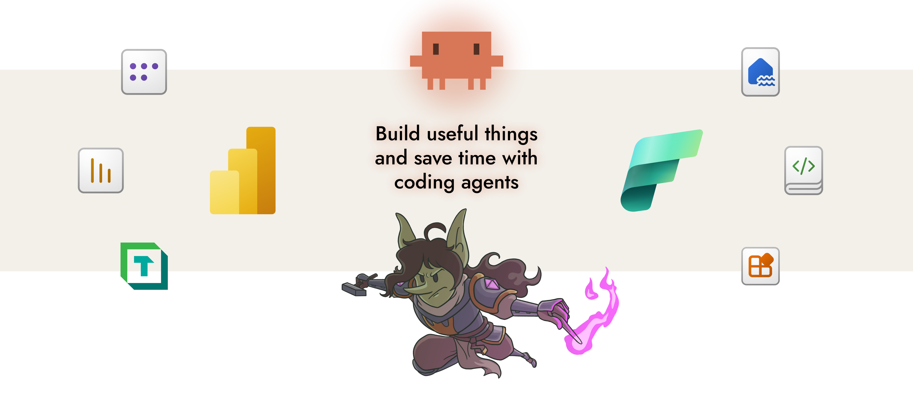
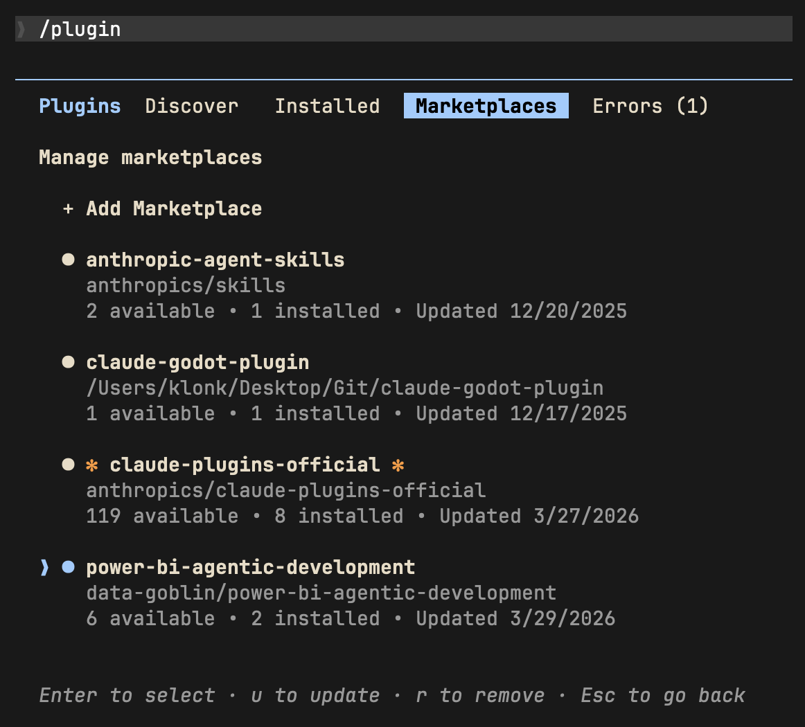
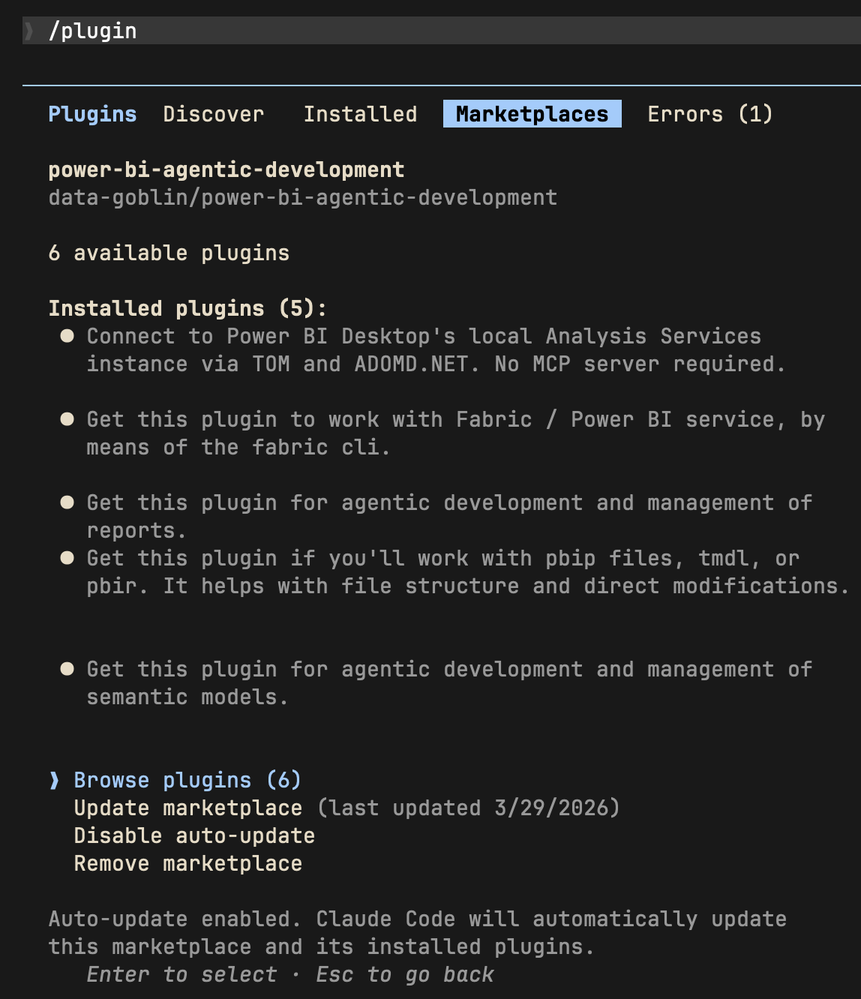

<p align="center">
  
</p>

<h1 align="center">power-bi-agentic-development</h1>

<p align="center">
  The best source for Power BI AI skills and agentic development resources in one marketplace <br></br>
  <i> Teach AI agents like Claude Code or GitHub Copilot Power BI and Microsoft Fabric </i>
</p>

<p align="center">
  
  
  
  
  
</p>

> [!WARNING]
> These skills are under active development with a weekly release cadence, so expect regular renaming and restructuring.
>
> **Versions 26.26 through 26.38 are a deliberate breaking transition.** Skills may be
> consolidated, renamed, removed, or made less automatic between weekly releases in this range.
> Pin **26.25 or earlier** if you need the pre-transition skill structure and behavior; do not
> assume compatibility from one transition release to the next.

---

### What is agentic development?

- *Agentic development* is when you use agents to help you build, manage, and optimize artifacts and software. This includes semantic models, reports, and the things around them, like workspaces, deployment pipelines, and also processes.
- A *marketplace* hosts *plugins* that you can install. Plugins are a collection of resources that help coding agents perform better. They are typically special instruction files and scripts. Plugins can contain skills, subagents, hooks, and MCP servers focused on special topics or tasks.
- This marketplace is focused on everything to help your agent work well with Power BI and Fabric: Power BI skills, Fabric skills, subagents, and hooks for coding agents. Read further for more information.

## Installation

Here's how you get started in Claude Code; run this in the terminal to get the marketplace: 

```bash
claude plugin marketplace add data-goblin/power-bi-agentic-development
```

### Example: Using the pbir-cli with the skills

[Click here for a YouTube walkthrough](https://www.youtube.com/watch?v=acHDorTi62U)

[](https://www.youtube.com/watch?v=acHDorTi62U)

### Claude Code

Add the marketplace, then install plugins via `/plugin` and navigating to the installed marketplace.

<table>
<tr>
<td align="center"></td>
<td align="center"></td>
</tr>
<tr>
<td align="center"><em>Install plugins from the marketplace</em></td>
<td align="center"><em>Enable marketplace auto-update</em></td>
</tr>
</table>

Alternative; add plugins via command line:

```bash
claude plugin install goblin-mode@power-bi-agentic-development
claude plugin install tabular-editor@power-bi-agentic-development
claude plugin install pbi-desktop@power-bi-agentic-development
claude plugin install pbip@power-bi-agentic-development
claude plugin install semantic-models@power-bi-agentic-development
claude plugin install reports@power-bi-agentic-development
claude plugin install paginated-reports@power-bi-agentic-development
claude plugin install custom-visuals@power-bi-agentic-development
claude plugin install fabric-cli@power-bi-agentic-development
claude plugin install fabric-admin@power-bi-agentic-development
claude plugin install databricks-cli@power-bi-agentic-development
claude plugin install fabric-data-app@power-bi-agentic-development
claude plugin install etl@power-bi-agentic-development
```

### Copilot CLI

The standalone [Copilot CLI](https://docs.github.com/en/copilot/how-tos/copilot-cli) supports plugin installation from GitHub repos. Copilot CLI reads the same `.claude-plugin/marketplace.json` manifest this repo uses, so the marketplace and child-plugin layout works without modification.

<details>
<summary><strong>Windows long paths</strong></summary>

TMDL files have a problem with repository-relative paths over 260 characters. Windows' legacy MAX_PATH blocks `git clone` from writing them unless long path support is enabled at both the OS and git level. Without this, `copilot plugin install` aborts with `Filename too long`.

Check [`useful-stuff/agent-scripts/enable-windows-longpaths.ps1`](useful-stuff/agent-scripts/enable-windows-longpaths.ps1) as an example of a script you can run from an elevated ps environment to enable long paths; there are other routes to do this that you can find online, too... just ask Copilot. A reboot is recommended after the registry change. This is a Windows OS limitation, documented at [Maximum Path Length Limitation](https://learn.microsoft.com/en-us/windows/win32/fileio/maximum-file-path-limitation).

See also the below `git config` command:

```powershell
git config --system core.longpaths true
```

</details>

<details>
<summary><strong>Additional installation instructions</strong></summary>

This repository is an [Anthropic-format plugin marketplace](https://code.claude.com/docs/en/plugin-marketplaces) (a set of plugins), not a single distributable plugin, so the root `.claude-plugin/` contains only `marketplace.json`. Two documented install paths work:

**1. Register the marketplace once, then install named child plugins. Example:**

```bash
copilot plugin marketplace add data-goblin/power-bi-agentic-development
copilot plugin install tabular-editor@power-bi-agentic-development
```

**2. Or install a single plugin directly from its subdirectory, no marketplace registration needed. Example:**

```bash
copilot plugin install data-goblin/power-bi-agentic-development:plugins/pbip
```

Both forms are documented in the [Copilot CLI plugin reference](https://docs.github.com/en/copilot/reference/copilot-cli-reference/cli-plugin-reference) and the [plugins how-to](https://docs.github.com/en/copilot/how-tos/copilot-cli/customize-copilot/plugins-finding-installing). Inside an interactive Copilot session, `/plugin install PLUGIN-NAME@MARKETPLACE-NAME` is the equivalent of (1). The bare `copilot plugin install data-goblin/power-bi-agentic-development` (no qualifier) will not install anything useful, because the root is a marketplace catalog, not a plugin.

</details>

<details>
<summary><strong>Verify installation in Copilot CLI</strong></summary>

Inside Copilot CLI:

```
/env                    # Loaded instructions, MCP servers, skills, agents, plugins, LSPs, extensions
/plugin list            # Installed plugins
/skills list            # Available skills
/skills info pbip       # Details for a specific skill
/agent                  # Browse installed agents
```

</details>

<details>
<summary><strong>Compatibility notes</strong></summary>

- **Skills** load identically; Copilot CLI reads `skills/<name>/SKILL.md`.
- **Agents** use the `*.agent.md` extension required by Copilot CLI's documented convention. Claude Code matches any `*.md` file in `agents/`, so the dual extension works in both tools.
- **MCP servers** load from `.mcp.json` (plugin root) or `.github/mcp.json`. The plugins in this repo do not currently ship MCP servers.
- **Hooks** ship twice. Claude Code reads `hooks/hooks.json` (with per-hook `if` path filters). Copilot CLI reads `.github/plugin/plugin.json`, which points it at `hooks/copilot-hooks.json`: the same scripts, wired with explicit `bash` and `powershell` commands so a Windows host without Git Bash on `PATH` gets a clean no-op instead of a failed launch. Copilot has no `if` filter and denies a tool call on any non-zero PreToolUse exit, so every script also re-applies its own path and command filters and exits 0 on anything unrelated. Requires Copilot CLI **>= 1.0.26** (2026-04-14) for `CLAUDE_PLUGIN_ROOT` ([changelog](https://github.com/github/copilot-cli/blob/main/changelog.md)); older builds skip the hooks rather than fail. Native Windows bash users may also hit a separate path-format bug tracked upstream at [claude-code#11984](https://github.com/anthropics/claude-code/issues/11984).
- **Scope** is always user-wide in Copilot CLI: plugins install to `~/.copilot/installed-plugins/` and their hooks run in every session on the machine. There is no per-project install, so the "prefer project scope" advice below applies to Claude Code only; in Copilot, install a plugin only while you need it.

</details>

<details>
<summary><strong>Uninstalling in Copilot CLI on Windows</strong></summary>

`/plugin rm` or `copilot plugin uninstall` can fail with `Access is denied. (os error 5)`. This is an open Copilot CLI bug, not a plugin problem: the installer swaps the plugin folder by renaming it, and Windows refuses the rename while another process holds a handle on it. VS Code's Copilot extension keeps directory watchers on every installed plugin's `hooks/`, `agents/` and `skills/` folders, and a second Copilot CLI session does the same. Tracked at [github/copilot-cli#4095](https://github.com/github/copilot-cli/issues/4095) and [#4151](https://github.com/github/copilot-cli/issues/4151).

1. Close every VS Code window and every other Copilot CLI session, then retry the uninstall.
2. If it still fails, delete the plugin by hand: remove its folder under `%USERPROFILE%\.copilot\installed-plugins\` (or `%COPILOT_HOME%\installed-plugins\`) and restart Copilot CLI.
3. To stop the hooks without uninstalling, delete the plugin's `hooks` folder from that same location.

</details>


## Overview

The repo contains skills, agents, and hooks.

- **Skills** teach agents domain knowledge and workflows. They activate automatically based on task context, or can be invoked manually with `/skill-name`. In Claude Code, skills and commands have coalesced; commands are simply more prescriptive skill workflows.
- **Agents** are autonomous subprocesses that handle complex, multi-step tasks independently; typically used for review and validation.
- **Hooks** run automatically after tool use to validate files and catch errors early. They are deterministic; they fire when a specific pattern is matched, not by LLM judgment.
- **Mods** add a pane to Claude Code itself; see [Claude Code mods](#claude-code-mods).

Hook checks can be individually toggled via config files. Set any check to `false` to disable it:
- `plugins/pbip/hooks/config.yaml` -- PBIR, TMDL, and report binding validation
- `plugins/pbi-desktop/hooks/config.yaml` -- DAX references, measure metadata, referential integrity, metadata cache

### Power BI and Fabric skills, agents, and hooks: available plugins

> [!WARNING]
> Don't install every plugin. Each skill competes for the agent's attention and context window, so install a plugin only when you need it and remove it when you don't. Prefer installing plugins scoped to a project rather than to your user, so each project carries only the skills it actually uses.

<details>
<summary><strong>goblin-mode</strong> &ensp; Get started, set up your tools, and audit and improve your whole agentic setup</summary>

| Type | Name | Description |
|------|------|-------------|
| Skill | [`help-me-get-started`](plugins/goblin-mode/skills/help-me-get-started/) | A slow, friendly, jargon-free guide to agentic development for people new to agents; talks through what you want to do, feels out your role and access, teaches the five pillars (model, context, prompt, tools, environment) with local interactive explainers, and checks and installs what you need (Windows/macOS commands). Adapts pace: full tutorial or a fast install run |
| Skill | [`improve-my-agent-setup`](plugins/goblin-mode/skills/improve-my-agent-setup/) | Setup-wide health check with modes (shallow/deep/ultra/yolo): skills, memory, tools, STT, model independence, other clients, harness config, git, permission/isolation, network and autonomous-agent exposure, safety enforcement, secrets and PII hygiene, and workflow habits; then offers to fix what's weak. Absorbs the old `/audit-context` |

</details>

<details>
<summary> <strong>tabular-editor</strong> &ensp; BPA rules, C# scripting, and CLI automation for Tabular Editor</summary>

| Type | Name | Description |
|------|------|-------------|
| Skill | [`bpa-rules`](plugins/tabular-editor/skills/bpa-rules/) | Create and improve Best Practice Analyzer rules for models |
| Skill | [`c-sharp-scripting`](plugins/tabular-editor/skills/c-sharp-scripting/) | C# scripting and macros for TE |
| Skill | [`te-cli`](plugins/tabular-editor/skills/te-cli/) | Cross-platform Tabular Editor CLI (`te`, preview) for semantic models from the terminal |
| Skill | [`te2-cli`](plugins/tabular-editor/skills/te2-cli/) | Tabular Editor 2 CLI usage and automation (not TE3) |
| Skill | [`te-docs`](plugins/tabular-editor/skills/te-docs/) | Tabular Editor documentation search, TE3 config files. Uses [`pbi-search`](https://github.com/data-goblin/pbi-search) CLI |
| Command | [`/suggest-rule`](plugins/tabular-editor/commands/suggest-rule.md) | Generate BPA rules from descriptions |
| Agent | [`bpa-expression-helper`](plugins/tabular-editor/agents/bpa-expression-helper.agent.md) | Debug and improve BPA rule expressions |

</details>

<details>
<summary> <strong>pbi-desktop</strong> &ensp; Connect to, query, and modify models in Power BI Desktop</summary>

| Type | Name | Description |
|------|------|-------------|
| Skill | [`connect-pbid`](plugins/pbi-desktop/skills/connect-pbid/) | Explore, query, and modify a model in Power BI Desktop, and reload/screenshot the report canvas via the Desktop Bridge |
| Agent | [`query-listener`](plugins/pbi-desktop/agents/query-listener.agent.md) | Capture DAX queries from Power BI Desktop visuals in real time |
| Hook | DAX reference validation | Validates table, column, and measure references against the connected model; suggests corrections |
| Hook | Measure metadata enforcement | Blocks adding measures without DisplayFolder, Description, and FormatString |
| Hook | Referential integrity check | Reports unmatched many-side keys after relationship or column changes |
| Hook | Metadata cache refresh | Auto-snapshots model metadata on TOM connect or model modification |
| Hook | Compatibility level check | Reports features available by upgrading; optional auto-upgrade |

</details>

<details>
<summary> <strong>pbip</strong> &ensp; Author and validate TMDL, PBIR, and PBIP project files</summary>

| Type | Name | Description |
|------|------|-------------|
| Skill | [`pbip`](plugins/pbip/skills/pbip/) | Power BI Project (PBIP) format, structure, and file types |
| Skill | [`tmdl`](plugins/pbip/skills/tmdl/) | Author and edit TMDL files directly |
| Skill | [`pbir-format`](plugins/pbip/skills/pbir-format/) | Author and edit PBIR metadata files directly (visual.json, report.json, themes, filters, report extensions, visual calculations) |
| Agent | [`pbip-validator`](plugins/pbip/agents/pbip-validator.agent.md) | Validate PBIP project structure, TMDL syntax, and PBIR schemas |
| Hook | PBIR validation | Validates PBIR structure, required fields, naming conventions, and schema URLs |
| Hook | Report binding validation | Validates semantic model binding (byPath directory exists; byConnection model exists via `fab exists`) |
| Hook | TMDL validation | Validates TMDL structural syntax |

</details>

<details>
<summary> <strong>reports</strong> &ensp; Build, format, optimize, and review interactive Power BI reports</summary>

| Type | Name | Description |
|------|------|-------------|
| Skill | [`create-pbi-report`](plugins/reports/skills/create-pbi-report/) | Step-by-step workflow for building a complete report from scratch via the `pbir` CLI: model discovery, pages, theme, visuals, field binding, filtering, formatting, validation, publishing |
| Skill | [`pbi-report-design`](plugins/reports/skills/pbi-report-design/) | The Power BI report design canon: design identity, visual hierarchy, layout, color discipline, chart selection, KPI/table design, accessibility. Shared reference used by the other report skills |
| Skill | [`modifying-theme-json`](plugins/reports/skills/modifying-theme-json/) | Design, enforce, audit, and validate report themes through the `pbir` CLI |
| Skill | [`review-report`](plugins/reports/skills/review-report/) | Actionable feedback on report quality, usage, and effectiveness; usage analysis, health checks |
| Skill | [`pbir-cli`](plugins/reports/skills/pbir-cli/) | Programmatic report manipulation via the [`pbir` CLI](https://github.com/maxanatsko/pbir.tools), including live Power BI Desktop refresh and page screenshots |
| Mod | [`/report-pane`](plugins/reports/hooks/) | Report pane: pages, visuals, bookmarks, filters and report measures of the `.Report` folder as a tree that follows `pbir`, with live highlights of what Claude reads or changes. Optional arg: a path to a `.Report` folder. Icons: [FabricSymbols NF](https://github.com/data-goblin/fabric-nf) |
| Agent | [`deneb-reviewer`](plugins/reports/agents/deneb-reviewer.agent.md) | Review Deneb visual specs for Vega/Vega-Lite syntax and conventions |
| Agent | [`svg-reviewer`](plugins/reports/agents/svg-reviewer.agent.md) | Review SVG DAX measures for syntax and design quality |
| Agent | [`r-reviewer`](plugins/reports/agents/r-reviewer.agent.md) | Review R visual scripts (ggplot2) for Power BI conventions |
| Agent | [`python-reviewer`](plugins/reports/agents/python-reviewer.agent.md) | Review Python visual scripts (matplotlib/seaborn) for Power BI conventions |

</details>

<details>
<summary><strong>paginated-reports</strong> &ensp; Author, validate, publish, and test print-ready paginated reports</summary>

| Type | Name | Description |
|------|------|-------------|
| Skill | [`paginated-report`](plugins/paginated-reports/skills/paginated-report/) | Author, validate, publish, and test Power BI paginated reports in RDL format (Report Builder, PBIRS/SSRS-compatible); connect to a semantic model, render to PDF/Excel |
| Hook | RDL validation | Validates `.rdl` structure after Write/Edit and on Bash commands touching `.rdl` files; blocks on structural errors only |

</details>

<details>
<summary><strong>custom-visuals</strong> &ensp; Build Deneb, Python, R, SVG, and pbiviz custom visuals for Power BI</summary>

| Type | Name | Description |
|------|------|-------------|
| Skill | [`deneb-visuals`](plugins/custom-visuals/skills/deneb-visuals/) | Deneb visual creation, Vega/Vega-Lite spec authoring, Deneb best practices for PBIR reports |
| Skill | [`r-visuals`](plugins/custom-visuals/skills/r-visuals/) | Custom R visuals (ggplot2) for Power BI reports |
| Skill | [`python-visuals`](plugins/custom-visuals/skills/python-visuals/) | Custom Python visuals (matplotlib/seaborn) for Power BI reports |
| Skill | [`svg-visuals`](plugins/custom-visuals/skills/svg-visuals/) | SVG generation via DAX measures and extension measures for inline chart visualizations (sparklines, bullet charts, KPI indicators, and more) |
| Skill | [`powerbi-custom-visuals`](plugins/custom-visuals/skills/powerbi-custom-visuals/) | Power BI developer custom visual (`.pbiviz`) development with the `pbiviz` toolchain and its MCP server: scaffold, build, debug, package, certify, publish to AppSource |

Reviewer agents for these visual types (`deneb-reviewer`, `svg-reviewer`, `r-reviewer`, `python-reviewer`) ship in the `reports` plugin above.

</details>

<details>
<summary> <strong>semantic-models</strong> &ensp; DAX, Power Query, naming, lineage, refresh, and model auditing</summary>

| Type | Name | Description |
|------|------|-------------|
| Skill | [`semantic-model`](plugins/semantic-models/skills/semantic-model/) | Design, build, refresh, and review semantic models through a `te`-first tool cascade |
| Skill | [`standardize-naming-conventions`](plugins/semantic-models/skills/standardize-naming-conventions/) | Audit and standardize naming conventions in semantic models |
| Skill | [`refresh-semantic-model`](plugins/semantic-models/skills/refresh-semantic-model/) | Trigger or troubleshoot refreshes |
| Skill | [`lineage-analysis`](plugins/semantic-models/skills/lineage-analysis/) | Trace downstream reports from a semantic model across workspaces |
| Skill | [`power-query`](plugins/semantic-models/skills/power-query/) | Write M expressions, debug query folding, execute M locally or via Fabric API |
| Skill | [`dax`](plugins/semantic-models/skills/dax/) | Write, debug, and optimize DAX in semantic models. Contributed by [Justin Martin](https://daxnoob.blog) |
| Agent | [`semantic-model-auditor`](plugins/semantic-models/agents/semantic-model-auditor.agent.md) | Audit semantic models for quality, memory, DAX, and design issues |

</details>

<details>
<summary> <strong>fabric-cli</strong> &ensp; Remote operations via Fabric CLI; works on Pro, PPU, or Fabric</summary>

| Type | Name | Description |
|------|------|-------------|
| Skill | [`fabric-cli`](plugins/fabric-cli/skills/fabric-cli/) | Fabric CLI (fab) for any remote operation in Power BI or Fabric (works fully on Pro, PPU; Fabric not required) |
| Command | [`/migrating-fabric-trial-capacities`](plugins/fabric-cli/commands/migrating-fabric-trial-capacities.md) | Migrate workspaces from trial to production capacity |
| Mod | [`/fabric-pane`](plugins/fabric-cli/hooks/) | Fabric pane: workspaces and items as a tree that follows `fab`, with live highlights, copy of fab paths, open in Fabric, and open semantic models in `te`. Optional arg: a workspace to reveal. Icons: [FabricSymbols NF](https://github.com/data-goblin/fabric-nf) |

</details>

<details>
<summary> <strong>fabric-admin</strong> &ensp; Tenant settings audits, governance, delegated overrides; requires fabric-cli</summary>

| Type | Name | Description |
|------|------|-------------|
| Skill | [`audit-tenant-settings`](plugins/fabric-admin/skills/audit-tenant-settings/) | Audit Fabric and Power BI tenant settings, delegated overrides, and Entra security group membership |

</details>

<details>
<summary><strong>databricks-cli</strong> &ensp; Databricks pane that follows the databricks CLI</summary>

| Type | Name | Description |
|------|------|-------------|
| Mod | [`/databricks-pane`](plugins/databricks-cli/hooks/) | Databricks pane: workspace, Unity Catalog, compute, jobs, pipelines, apps and dashboards as a tree that follows `databricks`, with live highlights, profile switching (`-p` or `DATABRICKS_CONFIG_PROFILE`), copy of CLI arguments, and open in Databricks. Optional arg: a profile. Icons: [DatabricksSymbols NF](https://github.com/data-goblin/databricks-nf) |

</details>

<details>
<summary><strong>fabric-data-app</strong> &ensp; Fabric Fabric app pane that follows the rayfin CLI</summary>

| Type | Name | Description |
|------|------|-------------|
| Mod | [`/fabric-app-pane`](plugins/fabric-data-app/hooks/) | Fabric app pane: every Fabric App (`rayfin/rayfin.yml`) under the working directory with its data sources, deploy state and files, as a tree that follows `rayfin`, with live highlights of what Claude deploys or changes. Optional arg: a folder. Icons: [FabricSymbols NF](https://github.com/data-goblin/fabric-nf) |

</details>

<details>
<summary><strong>etl</strong> &ensp; Inspect, query, and transform lakehouse data with Spark, Livy, and DuckDB</summary>

| Type | Name | Description |
|------|------|-------------|
| Skill | [`executing-spark`](plugins/etl/skills/executing-spark/) | Execute arbitrary Python or PySpark code on Fabric Spark compute without creating a notebook artifact; ephemeral Livy sessions with full Delta table access |
| Skill | [`using-duckdb`](plugins/etl/skills/using-duckdb/) | Query Fabric lakehouse and warehouse data with DuckDB, locally or inside a Fabric notebook; data freshness and quality checks |

</details>


## Claude Code mods

> [!WARNING]
> Mods only work in Claude Code 2.1.287 or newer. In other tools, such as Copilot CLI, the panes do not appear.

Mods add a pane to Claude Code's sidebar. These panes show your Fabric tenant, Databricks workspace, Power BI report or Fabric data apps as a tree beside the conversation, highlight what Claude reads, downloads, uploads, deploys or changes through the CLI, say when Claude is working, show spinners while a command runs, and pass the item you select to Claude as context. See the [Claude Code mod docs](https://code.claude.com/docs/en/plugins/mods/overview).

### Fabric pane

`/fabric-pane` from the `fabric-cli` plugin follows `fab`: workspaces grouped by domain, items, lakehouse tables and files.


### Databricks pane

`/databricks-pane` from the `databricks-cli` plugin follows `databricks`: workspace, Unity Catalog, compute, jobs, pipelines, apps and dashboards.


### Report pane

`/report-pane` from the `reports` plugin follows `pbir`: pages, visuals, bookmarks, filters and report measures of a `.Report` folder.


### Fabric app pane

`/fabric-app-pane` from the `fabric-data-app` plugin follows `rayfin`: every Fabric App under the working directory, its data sources, deploy state and files.


### Setup

- **Layout:** the sidebar needs the fullscreen layout (`/tui fullscreen`, or `"tui": "fullscreen"` in `~/.claude/settings.json`) and a terminal at least 110 columns wide. In the default layout or tmux the panes stay hidden and their command tells you how to switch. In a fullscreen session the Fabric, Databricks and report panes open by themselves on Claude's first `fab`, `databricks` or `pbir` command, and the Fabric app pane when the working directory holds a Fabric App
- **Icons:** install [FabricSymbols NF](https://github.com/data-goblin/fabric-nf) (Fabric, report and Fabric app panes) or [DatabricksSymbols NF](https://github.com/data-goblin/databricks-nf) together with a Nerd Font, then restart the terminal. Without them the panes use a Nerd Font alone, then plain Unicode. Auto detection covers Linux and macOS; on Windows set the `glyphs` option
- **Getting started:** when the CLI is missing, you are not signed in or the service can't be reached, the Fabric and Databricks panes show the steps to fix it, with commands you can copy
- **Options:** `glyphs` forces an icon set; `follow` (Follow Claude) decides whether the tree scrolls to what Claude touches; `fontHint` turns off the one-line install hint Claude gets once per session when the icons fall back to plain Unicode

## Useful stuff

General-purpose agent resources that don't fit into a plugin: defensive hooks, patterns, and tools. See [`useful-stuff/`](useful-stuff/).

## Use or re-use of these skills

These plugins are intended for free community use.

You do not have the license to copy and incorporate them into your own products, trainings, courses, or tools. If you copy these skills - manually or by using an agent to rewrite them - you must include attribution and a link to this original project. That includes you, Microsoft.


<br>

<p align="center">
  
</p>

---

<p align="center">
  <em>Built with assistance from <a href="https://claude.ai/claude-code">Claude Code</a>. AI-generated code has been reviewed but may contain errors. Use at your own risk.</em>
</p>

<p align="center">
  <em>Context files are human-written and revised by Claude Code after iterative use.</em>
</p>

---

<p align="center">
  <a href="https://github.com/data-goblin">Kurt Buhler</a> · <a href="https://data-goblins.com">Data Goblins</a> · part of <a href="https://tabulareditor.com">Tabular Editor</a>
</p>
